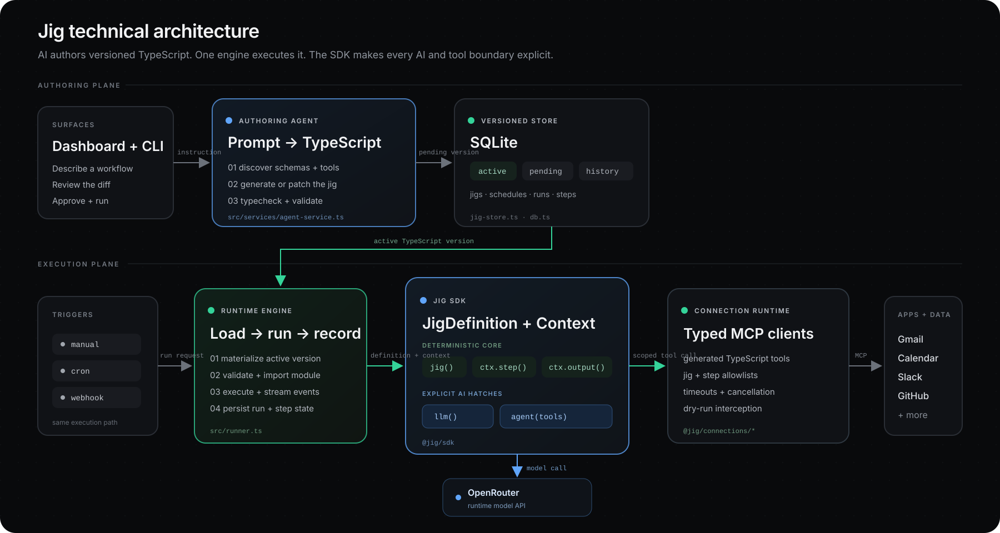

# Jig

**Trusted AI workflows as code.**

Describe a workflow in plain English. Jig turns it into versioned TypeScript you can review, run, and schedule.

[](https://railway.com/new/template/jig?utm_medium=integration&utm_source=button&utm_campaign=jig)

## Why Jig

A carpenter's jig is set once for repeatable results. Jig applies that idea to AI workflows: AI writes the workflow, then code runs it predictably.

Use plain code for repeatable work, `llm()` for bounded generation, and `agent()` only when runtime judgment is useful.

```text
Most agents:  LLM -> LLM -> LLM -> LLM -> result
              Every run depends on the model at every step.

Jig:          code -> code -> [AI] -> code -> result
              Code runs the workflow. AI is used deliberately.
```

## Architecture

Jig separates authoring from execution: a coding agent (Claude Code, Codex) writes a versioned TypeScript `JigDefinition` and pushes it over the CLI; the runtime imports the approved version; and the SDK enforces step, model, and typed MCP tool boundaries.



## Ideas for Your First Jig

* **Reasons to reach out.** Watch LinkedIn, news, and reminders for moments worth celebrating.
* **Post-meeting follow-up.** Turn notes and email threads into a thoughtful follow-up.
* **Reconnect radar.** Suggest people worth reconnecting with and explain why now.

## Example

> Every Monday at 8am, email me a concise update from last week's client meetings.

```typescript
import { jig, llm } from "@jig/sdk"
import { granola } from "@jig/connections/granola.js"

export default jig("weekly-client-update", {
  trigger: { type: "cron", cron: "0 8 * * 1" },
  tools: [granola.list_meetings],
}, async (ctx) => {
  let meetings: unknown

  await ctx.step("Gather meetings", [granola.list_meetings], async () => {
    meetings = await granola.list_meetings({ time_range: "last_week" })
    ctx.output(JSON.stringify(meetings, null, 2))
  })

  await ctx.step("Email update", [], async () => {
    const text = await llm("Write a concise client update.", { meetings }) as string
    await ctx.email({ subject: "Weekly client update", text })
    ctx.output(text)
  })
})
```

`ctx.step()` scopes each operation. `ctx.email()` sends a repliable notification to the configured owner; it does not create a Gmail draft.

## What You Get

* Versioned TypeScript workflows with reviewable changes
* Step-scoped tools and deliberate `llm()` / `agent()` boundaries
* MCP, Composio, Apify, and custom connections
* Local runs or always-on Railway deployment

## Install

**Railway:** the button above creates a fresh service with a blank `/data` volume and none of the maintainer's data, credentials, or configuration.

**From a clone:**

```Shell
git clone https://github.com/agamm/jig.git
cd jig
bun install
bun run jig setup          # offers to provision a hosted instance; --local for this machine
```

`jig setup` defaults to hosted, because a jig that only runs while your laptop is open is not
automation. Add `--local` to set up this machine instead, then `bun run jig start`.

**With a coding agent:** this repo ships a skill covering install, setup, Railway deploys and updates, so Claude Code or Codex can do the whole thing. Paste:

```text
Install and set up Jig from https://github.com/agamm/jig.git. Clone it, read
.agents/skills/jig/SKILL.md in the clone, and follow it. Ask me the questions it says to
ask before you start anything. Setup opens links for me to authorize; wait for me rather
than answering for me. When it is done, give me the dashboard URL and tell me which steps
came back ready.
```

## Setup

`bun run jig setup` walks what a new instance needs and proves each step rather than assuming it:

* **OpenRouter** for model calls. Authorize in the browser; the key is delivered to your instance and checked for credit, because a valid key with no balance fails every model call.
* **AgentMail** for failure alerts and reply-to-edit. Setup opens the console, names the clicks, and proves it by mailing you.
* **Composio** for app integrations, optional. One authorization covers Gmail, Calendar, Slack, Telegram and a long tail.

The dashboard's **Setup** page shows the same steps with live status, a button per step, and whether this instance's data will survive a restart. Nothing is pasted that a browser can authorize instead, so an agent running setup for you never handles a secret. Re-run it any time; satisfied steps are skipped. Details, including the no-terminal path, live in [`.agents/skills/jig/SKILL.md`](.agents/skills/jig/SKILL.md).

Then open the dashboard, connect what you need, and describe the workflow you want.

## Updating

```Shell
bun run jig update             # latest code and agent skills from GitHub
bun run jig update --remote    # ...then redeploy your instance with it
bun run jig update <handle>    # or move an instance to the newest release tag
```

`jig update` pulls this checkout forward and reinstalls dashboard deps, and tells you when the agent skills under `.agents/skills` have changed. Redeploying is opt-in, because it restarts running automation. The `<handle>` form deploys the newest release tag instead, waits for the health check, rolls back on failure, and refuses to move an instance onto an older tag. A Railway instance created with the template button has no clone attached, so update it by redeploying the service, which re-pulls the published image. Your jigs, credentials and schedules live in the database, not the source tree.

## Connections

Jig can connect workflows to external tools and data sources. The default registry in this repo includes:

* `granola`: meeting notes and transcripts
* `notion`, `linear`, `figma`, `sentry`, and other direct MCP services
* `apify`: typed tools for public-web scraping and extraction
* `composio`: Gmail, Calendar, GitHub, Slack, Telegram, and a long tail of SaaS apps

List available services with:

```Shell
bun run jig connect
```

Connect one with:

```Shell
bun run jig connect <service>
```

## How A Jig Is Structured

Each jig is a TypeScript file that exports `jig(name, options, handler)`.

* `trigger` decides when it runs: `manual`, `cron`, or `webhook`
* `tools` declares the tools the jig may use
* `ctx.step(...)` creates explicit execution steps
* `llm(...)` is for bounded generation without tool use
* `agent(...)` is for bounded agent behavior with a specific tool set

Generated jigs use these import aliases:

* `@jig/sdk`
* `@jig/connections/<service>`

## Project Layout

* `jig.db*`: ignored local state and the authoritative versioned jig store
* `.jig/connections/`: generated typed connection clients
* `.jig/schemas/`: cached tool schemas
* `examples/`: example jigs
* `dashboard/`: local UI for authoring and runs
* `src/`: runtime, CLI, scheduler, and code generation internals

## Coding Agents

Two skills, split by what you are doing:

* **Running an instance** (install, setup, connect, Railway deploy, update): [`.agents/skills/jig/SKILL.md`](.agents/skills/jig/SKILL.md), the cross-agent skills directory Claude Code, Codex, Cursor and OpenCode all read.
* **Writing workflow code**: [`SKILL.md`](SKILL.md), read completely before editing a jig.

[`llms.txt`](llms.txt) routes any other task, [`AGENTS.md`](AGENTS.md) is the cross-agent entry point, and [`docs/operations.md`](docs/operations.md) covers triage and recovery.

## CLI Commands

```Shell
bun run jig setup
bun run jig start
bun run jig update
bun run jig connect
bun run jig connect composio
bun run jig types                # the instance's connection types (.d.ts) into .jig/connections/
bun run jig edit weekly-update --file=weekly-update.ts  # push code you wrote (creates the jig if new; typechecked, pending)
bun run jig pending weekly-update approve
bun run jig edit weekly-update --out=weekly-update.ts    # export the live code to change it
bun run jig run weekly-update --dry-run
bun run jig run weekly-update
bun run jig pair <code>          # cache a CLI session for a deployed instance
bun run jig debug connections    # what a deployed instance has connected
bun run jig debug audit          # what is failing, since when, and the next command to heal it
```

`edit`, `run`, `pending` and `types` act on your deployed instance when you have one, and print which
instance they chose before starting. Add `--local` to act on this machine, or
`--handle=<name>` to choose between deployed instances.
